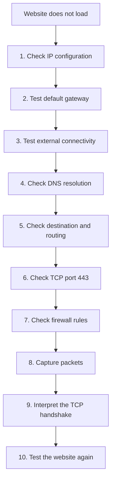
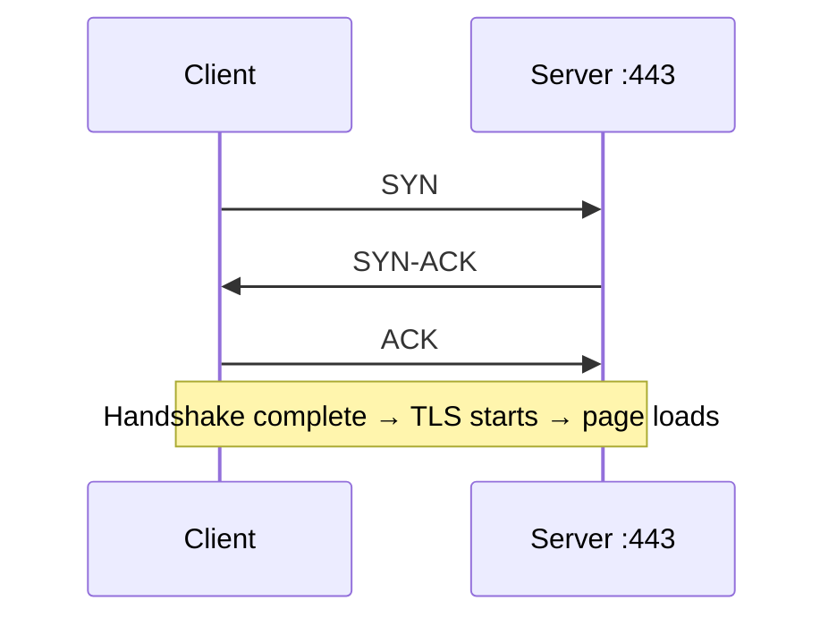
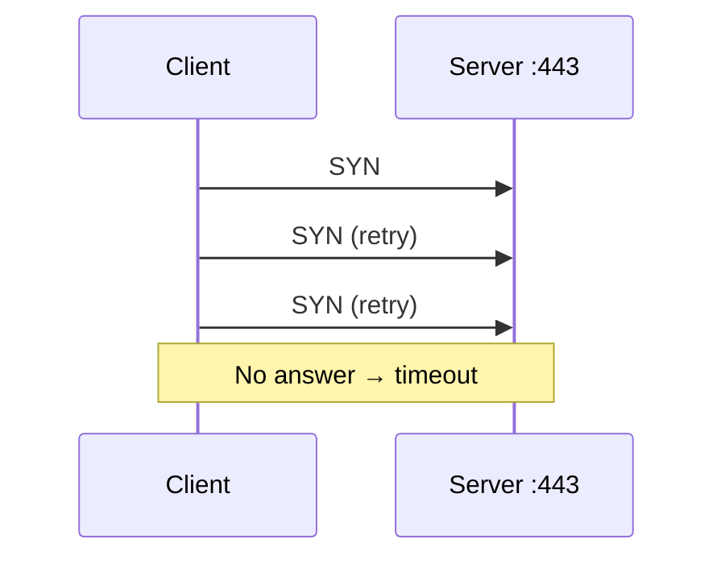
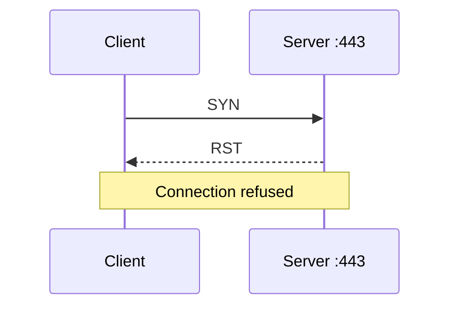

# my-contribution-TEAM6-TCP-IP-communication
Step-by-step guide to troubleshoot a website that does not load: from IP configuration to TCP port 443, firewall rules, packet capture and TCP handshake analysis.

# Troubleshooting: the website does not load

> **TCP/IP in Action** · Team 06

When a website does not open, the problem is often described too vaguely: *"the internet is down"*. A network administrator needs to be more precise. In an HTTPS scenario, the specific failure is usually this:

> **The TCP connection to the HTTPS service (port 443) cannot be established.**

This guide gives a **step-by-step method** to find where the communication breaks, working from the lowest level (local network configuration) up to the destination service, and finishing with packet analysis.

---

## Table of contents

1. [Overview of the method](#1-overview-of-the-method)
2. [Step-by-step troubleshooting](#2-step-by-step-troubleshooting)
3. [Reading the TCP handshake](#3-reading-the-tcp-handshake)
4. [Quick decision table](#4-quick-decision-table)
5. [Good practices](#5-good-practices)
6. [References](#6-references)

---

## 1. Overview of the method

The method has **10 steps**, ordered from local checks to deep analysis:

| # | Step | Tool / Command | What we want to know |
|---|------|----------------|----------------------|
| 1 | Check IP configuration | `ipconfig` / `ip addr` | Does the device have a valid IP, mask, gateway and DNS? |
| 2 | Test the default gateway | `ping <gateway IP>` | Can the device reach its local router? |
| 3 | Test external connectivity | `ping 8.8.8.8` | Can the device reach the Internet by IP address? |
| 4 | Check DNS resolution | `nslookup` / `dig` | Is the domain name translated into an IP address? |
| 5 | Check destination and routing | `tracert` / `traceroute` | Is the path to the destination reachable? |
| 6 | Check TCP port 443 | `Test-NetConnection` / `nc` / `curl` | Is port 443 open, blocked, refused or dropped? |
| 7 | Check firewall rules | OS firewall, router, server | Is a firewall blocking the traffic? |
| 8 | Capture packets | Wireshark / `tcpdump` | What really happens on the wire? |
| 9 | Interpret the TCP handshake | SYN, SYN-ACK, ACK or RST | Where exactly does the handshake fail? |
| 10 | Test the website again | browser / `curl` | Is the problem fixed? |



> **Why this order?** If the local IP configuration is wrong, nothing above it can work. Testing from the bottom up avoids wasting time on the wrong layer.

---

## 2. Step-by-step troubleshooting

### Step 1: Check IP configuration

**Goal:** make sure the device has a valid network configuration.

```bash
# Windows
ipconfig /all

# Linux
ip addr
ip route

# macOS
ifconfig
```

**Check:**
- A valid **IP address** (not `169.254.x.x` on Windows, which means DHCP failed).
- A correct **subnet mask**.
- A **default gateway**.
- A **DNS server**.

**If it fails:** renew the address (`ipconfig /renew` on Windows, or reconnect to the network), or fix the static configuration.

---

### Step 2: Test the default gateway

**Goal:** confirm that the device can reach its local router.

```bash
ping <gateway IP>
```

**Interpretation:**
-  Replies received → the local network (Layer 1/2/3 to the gateway) is working.
-  No reply → check cable / Wi-Fi, switch, VLAN, or the gateway itself.

>  Some devices block ICMP. A failed ping is a **clue**, not a final proof.

---

### Step 3: Test external connectivity

**Goal:** check Internet access **without using DNS**.

```bash
ping 8.8.8.8
```

**Interpretation:**
-  Replies → the device reaches the Internet by IP address.
-  No reply, while the gateway works → the problem is **beyond the local network** (ISP, router, NAT, upstream firewall).

---

### Step 4: Check DNS resolution

**Goal:** confirm that the domain name is translated into an IP address.

```bash
nslookup example.com
dig example.com

# Compare with a public resolver
nslookup example.com 8.8.8.8
dig @8.8.8.8 example.com
```

**Interpretation:**
   An IP address is returned → DNS works.
   `NXDOMAIN`, timeout or `SERVFAIL` → DNS problem (wrong DNS server, DNS blocked, domain error).
- If the **public resolver works but the default one does not** → the configured DNS server is the problem.

> 💡 If `ping 8.8.8.8` works but the name does not resolve, the issue is **DNS**, not connectivity.

---

### Step 5: Check destination and routing

**Goal:** verify that the path to the destination is reachable.

```bash
# Windows
tracert example.com
route print

# Linux / macOS
traceroute example.com
ip route
```

**Interpretation:**
- The trace stops at a specific hop → possible routing problem or filtering **after** that router.
- Stars (`* * *`) do not always mean failure: some routers simply do not answer probes.

---

### Step 6: Check TCP port 443

**Goal:** test the transport-level connection to the HTTPS service.

```powershell
# Windows (PowerShell)
Test-NetConnection example.com -Port 443
```

```bash
# Linux / macOS
nc -zv example.com 443

# Detailed HTTPS test
curl -v https://example.com
openssl s_client -connect example.com:443
```

**Three possible outcomes:**

| Result | Meaning |
|--------|---------|
| **Connected / succeeded** | Port 443 is open → TCP works. If the site still fails, look at TLS or the application. |
| **Connection refused** | The destination answered but refused (nothing listens on 443, or a reset was sent). |
| **Timeout** | Packets are silently **dropped** (firewall, routing or server down). |

---

### Step 7: Check firewall rules

**Goal:** find where traffic may be blocked. A firewall can exist at **four places**:

| Location | What to check |
|----------|---------------|
| **Client** | Host firewall / antivirus blocking outbound 443 |
| **Network** | Corporate firewall, proxy, ACLs |
| **Router** | Access lists, NAT rules |
| **Server** | Server firewall, security groups, service not listening |

```bash
# Windows
netsh advfirewall show allprofiles

# Linux
sudo ufw status
sudo iptables -L -n
sudo nft list ruleset
```

> A **drop** rule causes a **timeout**. A **reject** rule causes an immediate **refusal**. The difference helps locate the cause.

---

### Step 8: Capture packets

**Goal:** if the cause is still unclear, observe the real traffic.

```bash
# tcpdump (Linux)
sudo tcpdump -i any host <server IP> and tcp port 443

# Wireshark display filters
tcp.port == 443 && ip.addr == <server IP>
tcp.flags.syn == 1 && tcp.flags.ack == 0     # only SYN packets
tcp.flags.reset == 1                          # only RST packets
```

Start the capture **first**, then reload the website, and look at the first packets of the connection.

---

### Step 9: Interpret the TCP handshake

See [section 3](#3-reading-the-tcp-handshake): this is the key step that tells you **what the capture means**.

---

### Step 10: Test the website again

**Goal:** confirm that the fix works.

```bash
curl -I https://example.com
```

Also reload the page in the browser (clear cache if needed). Document what was wrong and what fixed it.

---

## 3. Reading the TCP handshake

A normal TCP connection starts with a **three-way handshake**. HTTPS/TLS only starts **after** it completes.

### Case 1: SYN → SYN-ACK → ACK (healthy)



**Meaning:** the TCP connection is established. If the website still fails, the problem is higher up (TLS certificate, HTTP error, application).

---

### Case 2: Repeated SYNs, no SYN-ACK



**Meaning:** possible **connectivity, firewall, routing or server-side issue**.

> This is a **symptom that requires further investigation**, not proof of one specific cause.

**What to check next:** routing (step 5), firewalls on each side (step 7), whether the server is up and listening, and a capture on **both** ends if possible.

---

### Case 3: SYN → immediate RST



**Meaning:** the destination **may be refusing the connection**.

**Possible causes:** no service listening on port 443, a firewall rule that rejects instead of drops, or a service that is stopped.

---

## 4. Quick decision table

| Observation | Likely area | Next action |
|-------------|-------------|-------------|
| No valid IP address | Local configuration / DHCP | Fix IP configuration (step 1) |
| Gateway does not answer | Local network | Check cable, Wi-Fi, switch (step 2) |
| Gateway OK, `8.8.8.8` fails | ISP / router / upstream | Check routing and NAT (steps 3, 5) |
| `8.8.8.8` OK, name fails | DNS | Check DNS settings (step 4) |
| Name resolves, port 443 times out | Firewall / routing / server | Steps 5, 7, 8 |
| Port 443 refused / RST | Destination service | Check that the service listens and the firewall rule |
| Handshake completes, page fails | TLS or application | Inspect certificate and HTTP response |

---

## 5. Good practices

- **Change one thing at a time** and retest after each change.
- **Work bottom-up**: local network → Internet → DNS → port → application.
- **Do not trust a single test**: ping can be blocked even when the service works.
- **Compare**: test from another device, another network, or another DNS server.
- **Capture only when needed**, with a precise filter to avoid noise.
- **Document** each test and result; it makes the diagnosis reproducible.
